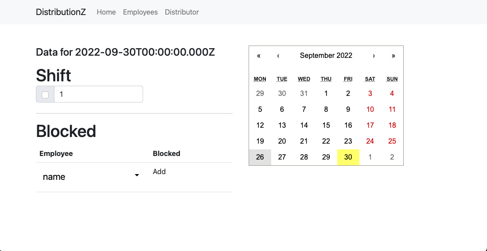

# DistrobutionZ

DistributionZ is a utility to easily distribute employees across shifts assigned. 

## Screenshots 

## Usage

Install DistributionZ from the [Releases page](/releases/latest)

- Add your Employees, desired shifts, employee count per shift and days where the employees are blocked. 

- Go to distribution and select the timeline where to distribute and a distributor. 

## Distributors

This utility provides a pluggable distributor system. If you desire to use another distributor, simply create a class. 

### RandomDistributor

The RandomsDistributor will distribute every employee at random. However if the employee is blocked on that day, he will not be used. 